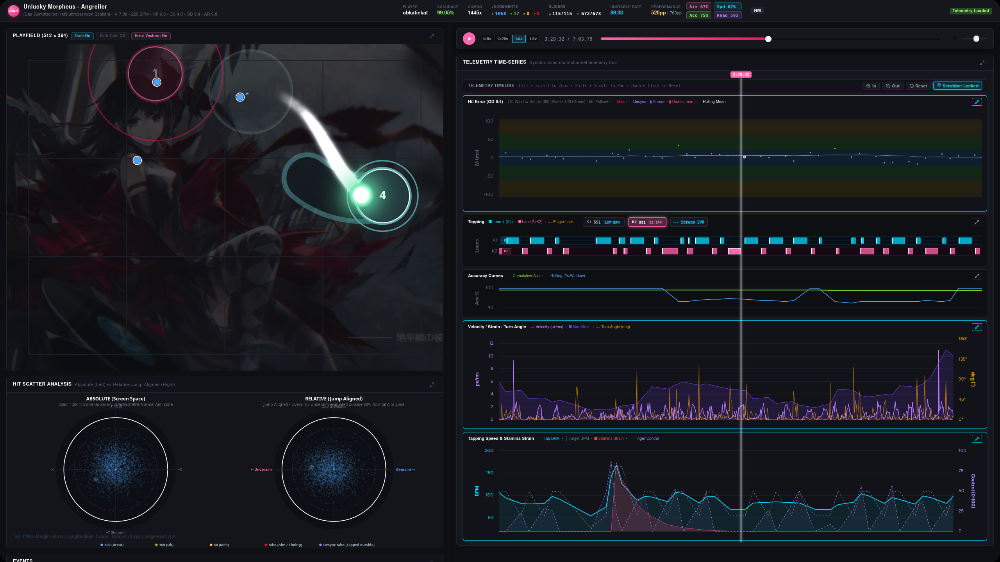
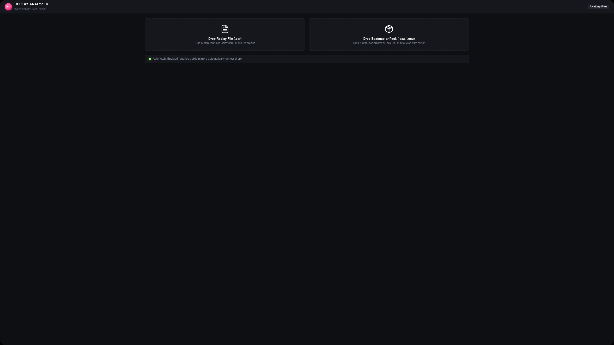
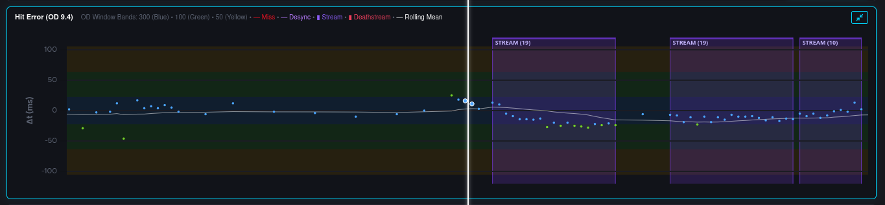
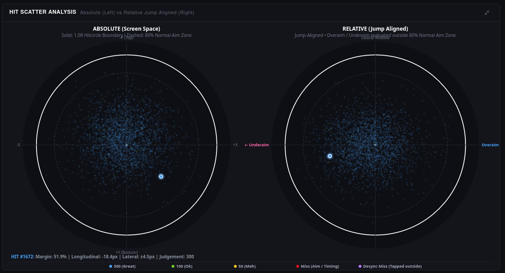
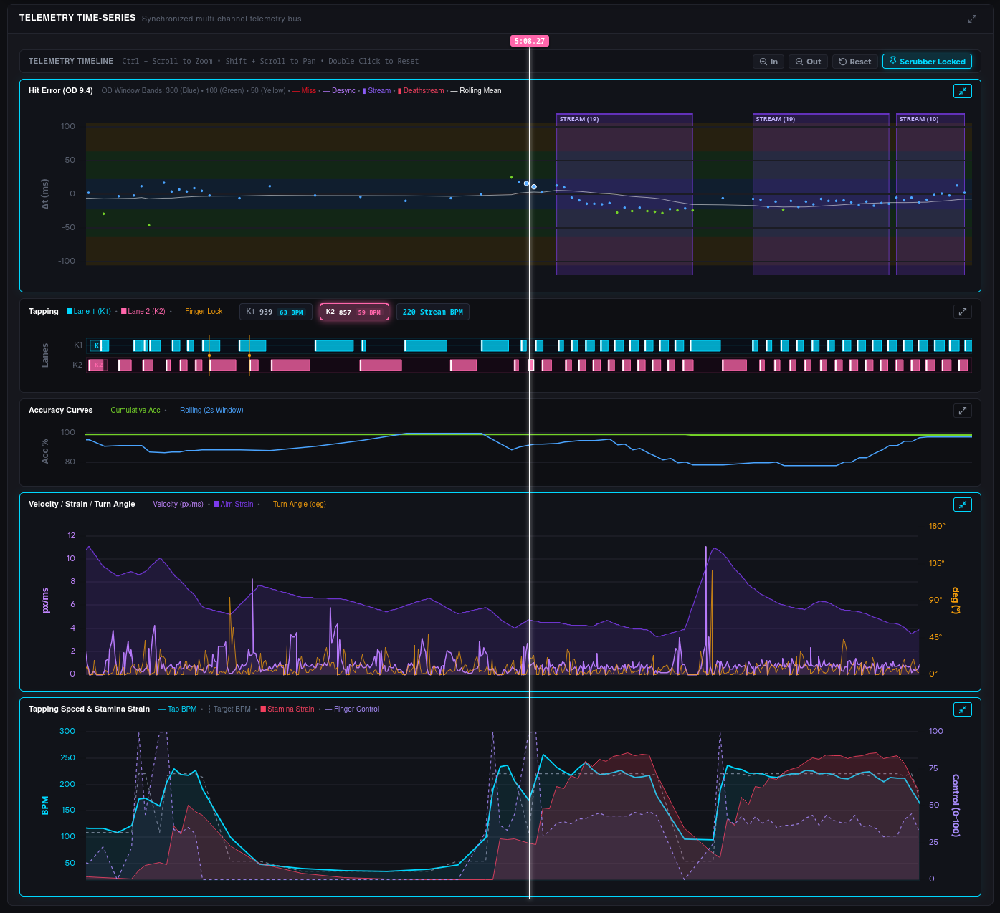
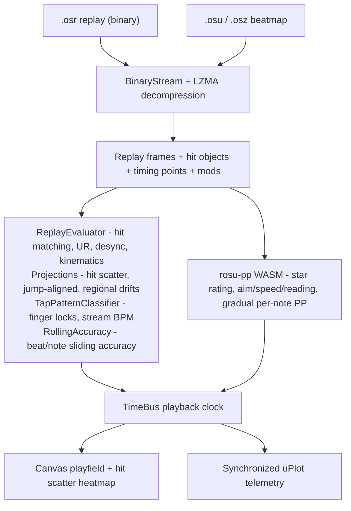

# OSRA - osu! Replay Analyzer

A browser-based replay telemetry and kinematic analysis tool for **osu!standard**, built against the
**osu!lazer** ruleset specification.

OSRA parses raw `.osr` replay files and `.osu`/`.osz` beatmaps entirely **in the browser**, then
reconstructs the mechanical story of a play: hit timing and unstable rate, aim-vs-tap desyncs,
cursor kinematics, tapping BPM and finger locks, beat-based rolling accuracy, spatial hit scatter,
and lazer-correct difficulty/performance calculation powered by Rust compiled to WebAssembly.


---

## Screenshots

| | |
| :---: | :---: |
|  |  |
| Main analysis workspace | Beatmap ingestion (replay & beatmap drop zones) |
|  |  |
| Hit error & timing windows timeline | Hit scatter heatmap (absolute + jump-aligned) |
|  | |
| Synchronized multi-channel telemetry | |

---

## Features

- **Client-side only.** Replays and beatmaps never leave your machine. Open a dragged-in file and
  analysis completes locally at bus speed.
- **Drag-and-drop ingestion.** Selectively drop a `(.osr)` replay plus the matching `(.osu)` beatmap
  or a whole `(.osz)` set. If only the replay is provided, OSRA auto-fetches the beatmap from public
  mirrors (`osu.direct`, `catboy.best`) keyed by the replay's MD5 beatmap hash.
- **osu!standard focus.** Replays of other game modes (`taiko`, `catch`, `mania`) are detected and
  rejected with a clear message. Other modes are scoped to the roadmap.
- **osu!lazer-faithful hit evaluation.** Exact `OsuHitWindows` (`od`, `ar`, `cs`, `hp`), the
  `Math.floor(range) - 0.5` lazer integer-truncation emulation and lazer slider-head accuracy.
- **Hit error & Unstable Rate.** Timeline dot scatter against color-coded OD windows, rolling mean
  drift and `±1σ` UR envelope, cumulative live UR, and stable-vs-lazer slider-head toggling.
- **Aim vs. tap desync classification.** Distinguishes a pure spatial aim miss from an early or late
  tap timing desync, and perimeter "margin chokes", per note.
- **Hit scatter heatmap.** Every hit projected onto a normalized circle of radius `R_CS` -
  both in absolute screen space and rotated into jump-aligned (overaim/underaim/lateral wobble) space.
- **Tapping dynamics.** Key hold durations, key-overlap finger-lock detection, and instantaneous
  individual and combined stream BPM plotted against the map's native tempo.
- **Beat-based rolling accuracy.** Rolling accuracy (`1/2/4/8` beats and note windows) that follows
  the tempo changes of the map rather than fixed note counts.
- **Cursor kinematics & strain overlay.** Velocity (`px/ms`), acceleration (`px/ms²`), turn-sharpness
  angles with snap-aim apex markers, overlaid on lazer aim/speed strain curves.
- **Lazer difficulty & performance.** Star rating and live per-note performance using a
  custom `rosu-pp` build - including the new lazer `reading` skill contributions.

---

## How it works




1. **Binary parsing.** `.osr` files are read through a small `DataView`-based `BinaryStream` with
   LZMA decompression (`lzma`), yielding monotonic `time|x|y|keys` frame deltas plus a lazer
   `LegacyReplaySoloScoreInfo` payload (rank, slider ticks/ends) when present. The initial RNG-seed
   frame is discarded before kinematics.
2. **Beatmap parsing.** `.osu` files are parsed into object trees and timing points (v14 spec).
   `.osz`/`.zip` sets are unpacked with `fflate`, and the correct difficulty is matched to the replay
   by MD5 checksum - otherwise a diff picker is shown.
3. **Reconciliation.** Frames are matched to hit objects using the lazer `timedHitEvents` rule set
   (hit circles + slider heads contribute to timing, UR; slider ticks/tails and spinners do not).
4. **Metrics.** The matched events feed discrete and time-series engines, all written into flat
   `Float64Array`/`Float32Array`/`Uint8Array` buffers sized for chart-render batching.
5. **Difficulty & performance.** A pre-built `rosu-pp` WASM bundle computes lazer star rating,
   aim/speed/reading difficulty, and a per-note `GradualPerformance` stepper that reproduces the
   in-game live PP HUD. A pure-TypeScript fallback keeps the app usable without WebAssembly.
6. **Rendering.** A single `TimeBus` clock synchronizes HTML5 audio, the Canvas 2D playfield, the
   hit scatter heatmap, and up to five uPlot channels with crosshair sync and scrubbing during
   playback.

### osu!lazer fidelity details

The evaluator deliberately mirrors lazer internals rather than approximating them:

- Circle radius: `R_CS = 64.0 × (0.85 − 0.07 × CS) × 1.00041` (the broken-gamefield rounding
  allowance), stacking offsets `StackHeight × Scale × (−6.4, −6.4)`.
- OD hit windows: `⌊80 − 6·OD⌋ − 0.5`, `⌊140 − 8·OD⌋ − 0.5`, `⌊200 − 10·OD⌋ − 0.5`, fixed `400 ms`
  miss window.
- UR: population standard deviation (Welford's one-pass variance) of rate-scaled hit offsets,
  multiplied by `10.0`.
- Mod scaling: HR (`CS×1.3`, `OD/AR/HP×1.4`, playfield flip on `y = 384`), EZ (`×0.5`), DT `1.5×`
  and HT `0.75×` rate scaling through the replay's real gameplay rate.

---

## Technical stack

| Concern | Choice |
| :--- | :--- |
| Language | TypeScript 5.8, strict, typed arrays throughout |
| Build | Vite 6.2 (`tsc && vite build`) |
| Tests | Vitest 3.0 |
| Replay/beatmap parsing | `BinaryStream` + `lzma` (LZMA decompression), `fflate` (zip/`.osz`) |
| Telemetry charts | [uPlot](https://github.com/leeoniya/uPlot) with shared synced crosshairs |
| Playfield & scatter | HTML5 Canvas 2D with high-DPI scaling and an included cursor skin |
| Difficulty/PP engine | Vendored `rosu-pp` (Rust → `wasm-pack --target web`) |
| External data | Public beatmap mirrors by MD5 (`osu.direct`, `catboy.best`) |

### The vendored rosu-pp pipeline

The difficulty engine is a pre-built WebAssembly bundle checked into `src/vendor/rosu-pp/`
(`rosu_pp_js.js`, `rosu_pp_js_bg.wasm`, `rosu_pp_js.d.ts`), compiled with
[`wasm-pack --target web`](https://rustwasm.github.io/wasm-pack/). It packages a fork of the
[rosu-pp-js](https://github.com/MaxOhn/rosu-pp-js) bindings (adapted in
[NeekoVN/rosu-pp-js](https://github.com/NeekoVN/rosu-pp-js)) that is rebuilt against
[rosu-pp-gemini](https://github.com/Rarendary/rosu-pp-gemini) - itself a fork of
[rosu-pp](https://github.com/MaxOhn/rosu-pp) that ports the lazer `reading` skill
(`reading` difficulty, `reading_difficult_note_count`, `pp_reading`). None of the binding code or
difficulty math is original; it is upstream work modified to expose the gemini fork's API.

The reading skill contributions are exposed in the header skill pills (`Read %`) and in the per-note
PP breakdown alongside aim, speed, and accuracy.

### Performance profile

Everything runs locally, so there are no network round-trips during analysis; scrubbing seeks an
exact frame index in `O(log N)` via binary search on the timestamp array, and all metric buffers are
pre-computed once on file load so timeline scrubbing stays interactive regardless of map length.

---

## Getting started

Requirements: Node.js 20+ and npm.

```bash
# Install dependencies
npm install

# Start the dev server
npm run dev

# Type-check and build a production bundle
npm run build

# Preview the production bundle
npm run preview
```

### Using the app

1. Open the app in a browser.
2. Drag a `.osr` replay into the replay dropzone.
3. Either drop the matching `.osu` file / `.osz` set, or let OSRA auto-fetch the beatmap from a
   public mirror using the replay's beatmap MD5.
4. The analyzer workspace opens with the playfield, hit scatter heatmap, synchronized telemetry
   charts, and an events inspector. Scrub the timeline or play back with audio; hover any chart to
   sync the playfield crosshair.

---

## Project structure

```
osra/
├── index.html                  # Single-page shell
├── package.json                # Scripts & dependencies
├── tsconfig.json               # TypeScript config
├── vite.config.ts              # Vite build/dev config
├── assets/screenshots/         # App screenshots (README)
├── src/
│   ├── main.ts                 # Ingestion, wiring, live top-bar stats
│   ├── core/
│   │   ├── binary/             # BinaryStream, .osr, .osu, .osz parsers, md5
│   │   ├── evaluator/          # ReplayEvaluator, TapPatternClassifier
│   │   ├── math/               # HitWindows, UnstableRate, DesyncClassifier,
│   │   │                       # Projections, RollingAccuracy, Kinematics,
│   │   │                       # LazerDifficulty, PerformancePoints
│   │   ├── api/                # MirrorClient (beatmap auto-fetch)
│   │   └── types/              # beatmap, replay, telemetry types
│   ├── ui/                     # TimeBus, canvas renderers, uPlot charts, components
│   ├── vendor/rosu-pp/         # Pre-built rosu-pp WASM bundle
│   ├── assets/skin/            # Cursor + cursor trail images
│   └── styles/                 # Stylesheet
└── README.md
```

---

## Roadmap

Highlights of what is planned next:

- osu!taiko, osu!catch, and osu!mania replay support
- Dedicated Web Worker offload for parsing and metric computation
- Diagnostic inspector presets (jump to misses, desyncs, finger locks)
- Telemetry export (PNG snapshot and JSON report)
- Hardware-latency and tablet smoothing compensation telemetry
- Hardening: corrupt-frame fuzzing, memory/buffer recycling budgets (< 120 MB peak)

---

## Acknowledgements

- **ppy / osu** - [osu!lazer](https://github.com/ppy/osu) and its ruleset definitions, hit windows,
  UR computation, and difficulty math, which this project is calibrated against.
- **MaxOhn** - [rosu-pp](https://github.com/MaxOhn/rosu-pp), the Rust difficulty/performance engine,
  and the original [rosu-pp-js](https://github.com/MaxOhn/rosu-pp-js) WebAssembly bindings.
- **Rarendary** - [rosu-pp-gemini](https://github.com/Rarendary/rosu-pp-gemini), the lazer `reading`
  skill fork OSRA builds against.
- **NeekoVN** - [rosu-pp-js](https://github.com/NeekoVN/rosu-pp-js) mod of the original bindings,
  adapted to build against the gemini fork's API.
- **leeoniya** - [uPlot](https://github.com/leeoniya/uPlot) for the telemetry charting.